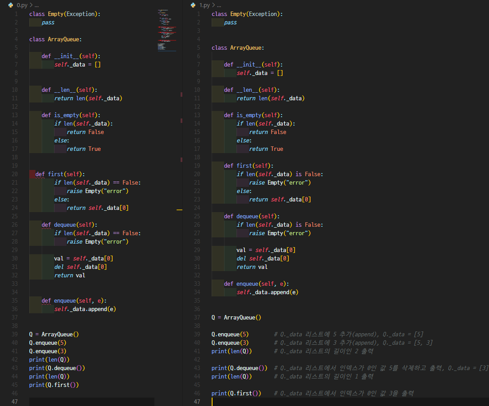

# PEP 8: 파이썬 코드를 아름답게 만드는 스타일 가이드

> "코드는 쓰는 것보다 읽히는 횟수가 훨씬 많다." - Guido van Rossum

---

## 목차
- [들어가며](#들어가며)
- [PEP 8이란?](#pep-8이란)
- [왜 코딩 규칙이 필요한가?](#왜-코딩-규칙이-필요한가)
- [PEP 8 핵심 원칙](#pep-8-핵심-원칙)
- [실습: Before & After](#실습-before--after)
- [마치며](#마치며)
- [참고 자료](#참고-자료)

---

## 들어가며

파이썬을 처음 배우면 일단 돌아가면 된다는 생각으로 코드를 작성하기 쉽다. 하지만 협업 환경에서, 또는 몇 달 뒤 자신의 코드를 다시 볼 때, 일관성 없는 코드는 큰 고통이 된다.

이 글에서는 파이썬 공식 스타일 가이드인 PEP 8이 무엇인지, 왜 필요한지, 그리고 실제로 어떻게 적용하는지 알아보겠다.

---

## PEP 8이란?

PEP 8(PEP8, PEP-8)은 파이썬 코드 작성 방법에 대한 공식 스타일 가이드이다.

| 항목 | 내용 |
|------|------|
| **작성자** | Guido van Rossum 외 2명 |
| **PEP의 의미** | Python Enhancement Proposal (파이썬 향상 제안) |
| **핵심 목표** | 파이썬 코드의 가독성과 일관성 개선 |

---

## 왜 코딩 규칙이 필요한가?

### 1. 소프트웨어 유지 관리 비용 절감

코딩 규칙을 따르는 가장 큰 이유는 유지 관리 비용 절감이다.

코드는 한 번 작성되지만, 수십 번, 수백 번 읽히고 수정된다.

일관된 스타일로 작성된 코드는:
- 새로운 팀원이 빠르게 코드를 이해할 수 있다.
- 버그를 찾고 수정하는 시간이 단축된다.
- 코드 리뷰가 효율적으로 진행된다.

### 2. 소프트웨어 동료 평가 (Peer Review)

소프트웨어 동료 평가란 동료가 작업물(코드, 문서 등)을 검토하여 품질을 평가하는 과정이다.

일관된 코딩 스타일은 리뷰어가 로직에 집중할 수 있게 해준다. 스타일이 제각각이면 "왜 여기는 들여쓰기가 다르지?"와 같은 불필요한 질문에 시간을 낭비하게 된다.

### 3. 리팩토링

리팩토링은 코드의 동작을 변경하지 않으면서 내부 구조를 개선하는 작업이다.

- 일반적인 리팩토링 활동
  - 변수명 변경
  - 함수명 변경
  - 클래스/메소드 이동
  - 큰 함수를 작은 함수로 분리

일관된 코딩 스타일은 리팩토링 시 어떤 부분이 변경되었는지 명확하게 파악할 수 있게 한다.

---

## PEP 8 핵심 원칙

### 1. 명명 규칙 (Naming Conventions)

> *"명시적인 것이 암묵적인 것보다 낫다."*

좋은 이름은 코드의 의도를 드러낸다.

```python
# Bad
x = 10
def f(a, b):
    return a + b

# Good
user_count = 10
def calculate_total(price, quantity):
    return price * quantity
```

### 2. 코드 레이아웃 (Code Layout)

> *"아름다운 것이 못생긴 것보다 낫다."*

코드의 시각적 구조는 가독성에 직접적인 영향을 준다.

- 한 줄은 79자 이내로 제한
- 최상위 함수/클래스는 2줄 공백으로 구분
- 클래스 내 메소드는 1줄 공백으로 구분

### 3. 들여쓰기 (Indentation)

> *"그것을 할 수 있는 확실한 방법은 하나, 그리고 가급적이면 단 하나여야 한다."*

파이썬에서 들여쓰기는 단순한 스타일이 아닌 문법이다.

```python
# 각 들여쓰기 레벨은 4칸 공백
def outer_function():
    def inner_function():
        if condition:
            do_something()
```

### 4. 주석 (Comments)

> *"구현이 설명하기 어렵다면 그것은 나쁜 생각이다."*

주석은 왜(Why) 그렇게 했는지를 설명해야 한다. 무엇(What)은 코드 자체가 말해야 한다.

```python
# Bad: 무엇을 하는지 설명
x = x + 1  # x를 1 증가시킴

# Good: 왜 그렇게 하는지 설명
x = x + 1  # 경계 조건을 맞추기 위해 오프셋 추가
```

### 5. 프로그래밍 권장 사항

> *"복잡한 것보다 단순한 것이 낫다."*

```python
# Bad
if len(my_list) == 0:
    print("Empty")

# Good
if not my_list:
    print("Empty")
```

---

## 실습: Before & After

실제 코드에 PEP 8을 적용해보자. 아래는 Queue 자료구조를 구현한 코드이다.

### Before (수정 전)

```python
class Empty(Exception):
    pass

class ArrayQueue:

    def __init__(self):
        self._data = []


    def __len__(self):
        return len(self._data)

    def is_empty(self):
        if len(self._data):
            return False
        else:
            return True


  def first(self):          # 들여쓰기 오류!
        if len(self._data) == False:   # 잘못된 비교
            raise Empty("error")
        else:
            return self._data[0]
```

### After (수정 후)

```python
class Empty(Exception):
    pass


class ArrayQueue:
    """배열 기반 큐(Queue) 자료구조 구현"""

    def __init__(self):
        self._data = []

    def __len__(self):
        return len(self._data)

    def is_empty(self):
        return not self._data

    def first(self):
        if not self._data:
            raise Empty("Queue is empty")
        return self._data[0]
```

### 주요 변경 사항

| 구분 | Before | After |
|------|--------|-------|
| 클래스 간 공백 | 1줄 | 2줄 |
| 들여쓰기 | 불일치 (2칸) | 일관된 4칸 |
| 빈 리스트 체크 | `len(x) == False` | `not x` |
| 에러 메시지 | `"error"` | `"Queue is empty"` |

### 코드 비교 이미지



### 실행 결과

```python
Q = ArrayQueue()

Q.enqueue(5)        # Q._data = [5]
Q.enqueue(3)        # Q._data = [5, 3]
print(len(Q))       # 출력: 2

print(Q.dequeue())  # 출력: 5, Q._data = [3]
print(len(Q))       # 출력: 1

print(Q.first())    # 출력: 3
```

---

## 마치며

처음에는 번거롭게 느껴질 수 있지만, 습관이 되면 오히려 코드 작성이 더 빨라진다. 스타일에 대한 고민 없이 **로직에만 집중**할 수 있기 때문이다.

### 추천 도구

- **black**: 자동 코드 포맷터
- **flake8**: PEP 8 준수 검사 도구
- **pylint**: 종합 코드 분석 도구

```bash
pip install black flake8
black your_code.py
flake8 your_code.py
```

---

## 참고 자료

- [PEP 8 공식 문서](https://peps.python.org/pep-0008/)
- [Black - The Uncompromising Code Formatter](https://black.readthedocs.io/)
- [PEP 8 스타일 가이드 정리 (한글)](https://velog.io/@chldppwls12/PEP-8-스타일-가이드)